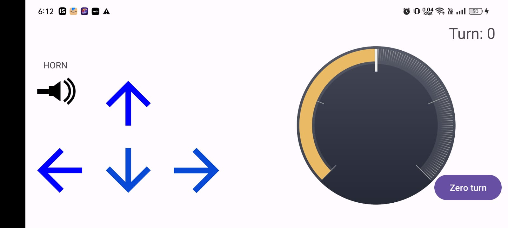

# robot_car_controller
an andorid app to control esp32 powered robot car




```kotlin
 private val ESP32_MAC = "5C:01:3B:33:92:E6"
//change the mac address , find your esp32 mac address in nRF Connect
