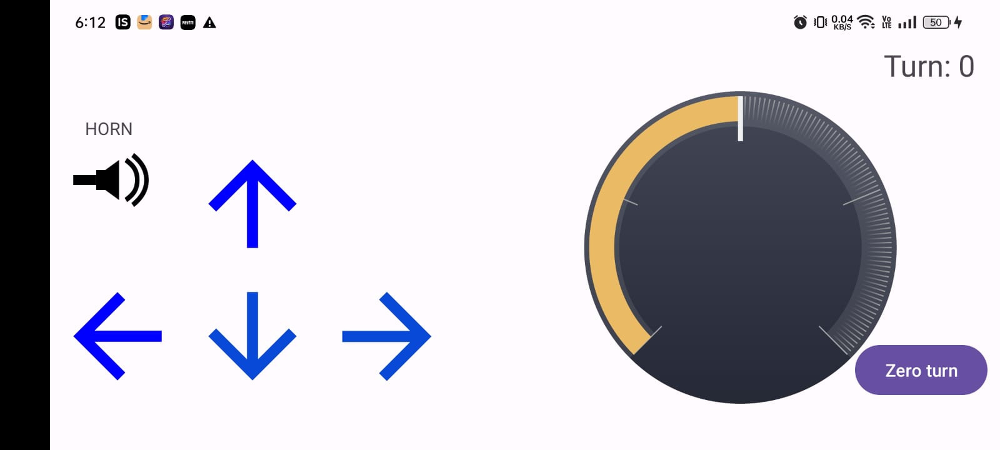

# robot_car_controller
an andorid app to control esp32 powered robot car




```kotlin
 private val ESP32_MAC = "5C:01:3B:33:92:E6"
//change the mac address , find your esp32 mac address in nRF Connect

```

## steps
1. install nRF connect app on your android app
2. paste esp32 code (from  github, you can do changes in codes ) PYTHON code
3. install or build the android app (or even you can use app from gihub ) to control the robot, KOTLIN CODE
4. now first turn on the robot , (BLUE LIGHT will keep blinking until you do connect it )
5. do connect it from nRF app ( you will se the BLE ,, some sort name )
6. after connection , open the controller app, check the movements,
7. if it don't works,  do debugging
8. 
